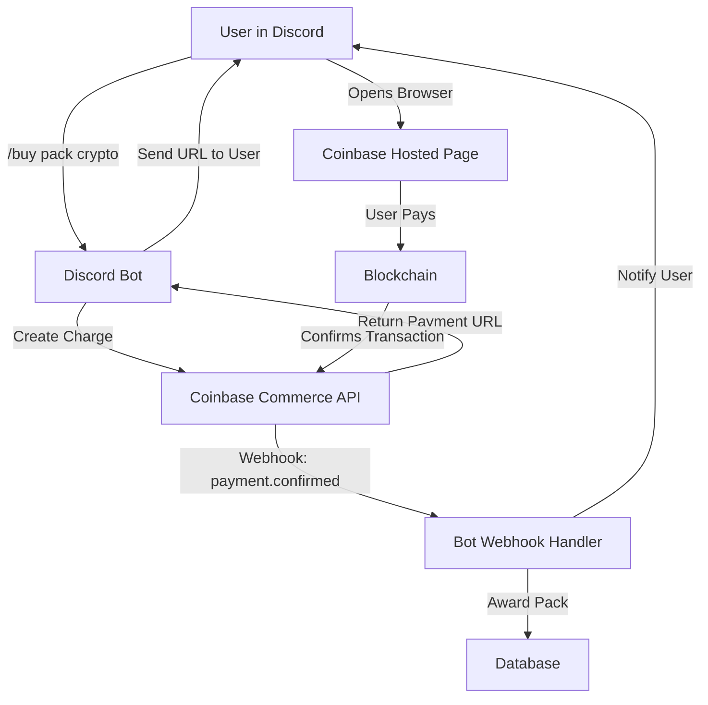

# CRYPTO_PAYMENT_PLAN.md
# Cryptocurrency Payment Integration Plan

## Executive Summary
This document outlines the plan to integrate cryptocurrency payments into the Music Legends bot as an alternative to Stripe for pack purchases and premium features.

## Recommended Provider: **Coinbase Commerce**

### Why Coinbase Commerce?
1. **Easiest Integration** - Simple REST API, no complex blockchain interactions
2. **Multi-Crypto Support** - BTC, ETH, USDC, DAI, LTC, BCH, DOGE
3. **No KYC Required** - For merchants under certain thresholds
4. **Automatic Conversions** - Can auto-convert crypto to USD
5. **Established Reputation** - Backed by Coinbase, trusted platform
6. **Free to Use** - No monthly fees, only 1% transaction fee

### Alternative Providers Considered

| Provider | Pros | Cons | Recommended? |
|----------|------|------|--------------|
| **Coinbase Commerce** | Easy, trusted, multi-crypto | 1% fee | ✅ **YES** |
| **NOWPayments** | 170+ cryptos, 0.5% fee | Less known, more complex | ⚠️ Maybe |
| **BitPay** | Enterprise-grade, established | Higher fees (1%), complex setup | ❌ No |
| **CoinGate** | Low fees (1%), good EU support | Smaller user base | ⚠️ Maybe |

## Integration Architecture



## Database Schema Changes

### New Table: crypto_payments

```sql
CREATE TABLE IF NOT EXISTS crypto_payments (
    payment_id TEXT PRIMARY KEY,
    user_id INTEGER NOT NULL,
    pack_type TEXT NOT NULL,
    amount_crypto TEXT NOT NULL,
    currency TEXT NOT NULL, -- BTC, ETH, USDC, etc.
    amount_usd_cents INTEGER NOT NULL,
    coinbase_charge_id TEXT UNIQUE,
    status TEXT DEFAULT 'pending', -- pending, confirmed, failed, expired
    payment_url TEXT,
    created_at TIMESTAMP DEFAULT CURRENT_TIMESTAMP,
    confirmed_at TIMESTAMP,
    blockchain_tx_hash TEXT,
    FOREIGN KEY (user_id) REFERENCES users(user_id)
);
```

## Implementation Steps

### Phase 1: Setup (1-2 hours)
1. Sign up for Coinbase Commerce account
2. Get API key and webhook secret
3. Add to environment variables:
   ```
   COINBASE_COMMERCE_API_KEY=your_key_here
   COINBASE_COMMERCE_WEBHOOK_SECRET=your_webhook_secret
   ```
4. Install SDK: `pip install coinbase-commerce`

### Phase 2: Code Implementation (3-4 hours)

#### File: `crypto_payments.py`
```python
from coinbase_commerce.client import Client
from coinbase_commerce.models import Charge
import os

class CryptoPaymentManager:
    def __init__(self):
        self.client = Client(api_key=os.getenv('COINBASE_COMMERCE_API_KEY'))
    
    def create_pack_charge(self, user_id: int, pack_type: str, price_usd: float):
        """Create a Coinbase Commerce charge for pack purchase"""
        charge_data = {
            'name': f'{pack_type.title()} Pack',
            'description': f'Music Legends {pack_type} pack purchase',
            'local_price': {
                'amount': str(price_usd),
                'currency': 'USD'
            },
            'pricing_type': 'fixed_price',
            'metadata': {
                'user_id': str(user_id),
                'pack_type': pack_type,
                'discord_purchase': 'true'
            }
        }
        
        charge = self.client.charge.create(**charge_data)
        return {
            'charge_id': charge.id,
            'payment_url': charge.hosted_url,
            'addresses': charge.addresses
        }
```

#### File: `webhooks/coinbase_webhook.py`
```python
from coinbase_commerce.webhook import Webhook
import os

def handle_coinbase_webhook(request_body: str, signature: str):
    """Handle Coinbase Commerce webhooks"""
    webhook_secret = os.getenv('COINBASE_COMMERCE_WEBHOOK_SECRET')
    
    try:
        event = Webhook.construct_event(request_body, signature, webhook_secret)
        
        if event.type == 'charge:confirmed':
            # Payment confirmed! Award the pack
            charge = event.data
            user_id = int(charge.metadata['user_id'])
            pack_type = charge.metadata['pack_type']
            
            # Award pack to user
            from database import DatabaseManager
            db = DatabaseManager()
            # ... award logic ...
            
            return {'status': 'success'}
    
    except Exception as e:
        return {'status': 'error', 'message': str(e)}
```

#### Discord Command: `/buy_pack_crypto`
```python
@app_commands.command(name="buy_pack_crypto", description="Purchase a pack with cryptocurrency")
@app_commands.describe(pack_type="Pack type: community, gold, premium")
async def buy_pack_crypto(self, interaction: Interaction, pack_type: str):
    """Buy pack with crypto"""
    from crypto_payments import CryptoPaymentManager
    
    prices = {'community': 2.99, 'gold': 4.99, 'premium': 9.99}
    price = prices.get(pack_type.lower())
    
    if not price:
        await interaction.response.send_message("❌ Invalid pack type!", ephemeral=True)
        return
    
    crypto_manager = CryptoPaymentManager()
    charge = crypto_manager.create_pack_charge(interaction.user.id, pack_type, price)
    
    embed = discord.Embed(
        title="💎 Crypto Payment",
        description=f"Pay with Bitcoin, Ethereum, or other cryptocurrencies!",
        color=discord.Color.blue()
    )
    embed.add_field(name="Pack", value=pack_type.title(), inline=True)
    embed.add_field(name="Price", value=f"${price}", inline=True)
    embed.add_field(
        name="Payment Link",
        value=f"[Click here to pay]({charge['payment_url']})",
        inline=False
    )
    embed.set_footer(text="Payment will be confirmed automatically within 10 minutes")
    
    await interaction.response.send_message(embed=embed, ephemeral=True)
```

### Phase 3: Webhook Setup (1 hour)
1. Deploy webhook endpoint on Railway
2. Configure webhook URL in Coinbase Commerce dashboard
3. Test with Coinbase Commerce sandbox mode

### Phase 4: Testing (2-3 hours)
1. Test with Coinbase test mode
2. Test each cryptocurrency (BTC, ETH, USDC)
3. Test edge cases:
   - Expired payments
   - Underpayment
   - Overpayment
   - Network congestion

## User Flow

1. User runs `/buy_pack_crypto gold`
2. Bot creates Coinbase Commerce charge
3. Bot sends payment link to user (ephemeral message)
4. User clicks link, opens Coinbase-hosted payment page
5. User selects cryptocurrency (BTC, ETH, USDC, etc.)
6. User sends payment from their wallet
7. Blockchain confirms transaction (5-30 minutes depending on crypto)
8. Coinbase sends webhook to bot
9. Bot awards pack to user
10. Bot sends confirmation DM to user

## Cost/Benefit Analysis

### Transaction Fees Comparison

| Payment Method | Fee | $10 Purchase | $50 Purchase | $100 Purchase |
|---------------|-----|--------------|--------------|---------------|
| **Stripe (Credit Card)** | 2.9% + $0.30 | $0.59 | $1.75 | $3.20 |
| **Coinbase Commerce** | 1% | $0.10 | $0.50 | $1.00 |
| **Savings with Crypto** | - | $0.49 (83%) | $1.25 (71%) | $2.20 (69%) |

### Benefits
- ✅ Lower fees (1% vs 2.9% + $0.30)
- ✅ Global access (no credit card required)
- ✅ Appeals to crypto-native Discord users
- ✅ Instant settlement (no chargebacks)
- ✅ Privacy-focused (less personal data collection)

### Drawbacks
- ❌ Confirmation delays (5-30 minutes)
- ❌ Volatility risk (price can change during checkout)
- ❌ Requires user to own cryptocurrency
- ❌ Additional complexity in codebase
- ❌ Tax reporting complexity

## Implementation Timeline

| Phase | Duration | Effort |
|-------|----------|--------|
| Phase 1: Setup | 1-2 hours | Easy |
| Phase 2: Code | 3-4 hours | Medium |
| Phase 3: Webhooks | 1 hour | Easy |
| Phase 4: Testing | 2-3 hours | Medium |
| **TOTAL** | **7-10 hours** | **Medium** |

## Maintenance Requirements
- Monthly check of Coinbase Commerce dashboard
- Monitor webhook success rate
- Update crypto prices if implementing manual pricing
- Tax reporting for crypto transactions (consult accountant)

## User Demand Assessment

### Estimated Adoption
Based on Discord gaming bot statistics:
- 5-15% of users prefer crypto payments
- Higher adoption in crypto-focused Discord servers
- Lower adoption in general gaming communities

### Recommendation
**Implement crypto after core features are stable:**
1. Get Stripe working perfectly first
2. Gather user feedback on payment preferences
3. If 10+ users request crypto, implement it
4. Start with Coinbase Commerce (easiest)
5. Expand to other providers based on demand

## Security Considerations
1. **Never store private keys** - Coinbase handles all wallet management
2. **Verify webhooks** - Always validate signature
3. **Idempotency** - Prevent double-spending with unique charge IDs
4. **Rate limiting** - Prevent abuse of payment link generation
5. **Monitoring** - Alert on failed webhooks or stuck payments

## Conclusion
Cryptocurrency payment integration via Coinbase Commerce is **feasible and beneficial** but should be implemented **after Stripe is stable**. The 1% fee vs Stripe's 2.9% + $0.30 provides significant savings, especially for larger purchases.

**Next Steps:**
1. Stabilize core bot features
2. Collect user feedback on crypto demand
3. If demand exists, implement Phase 1 setup
4. Roll out in beta to test server first
5. Full launch after successful testing

---

**Document Version:** 1.0  
**Last Updated:** January 31, 2026  
**Author:** Music Legends Development Team
